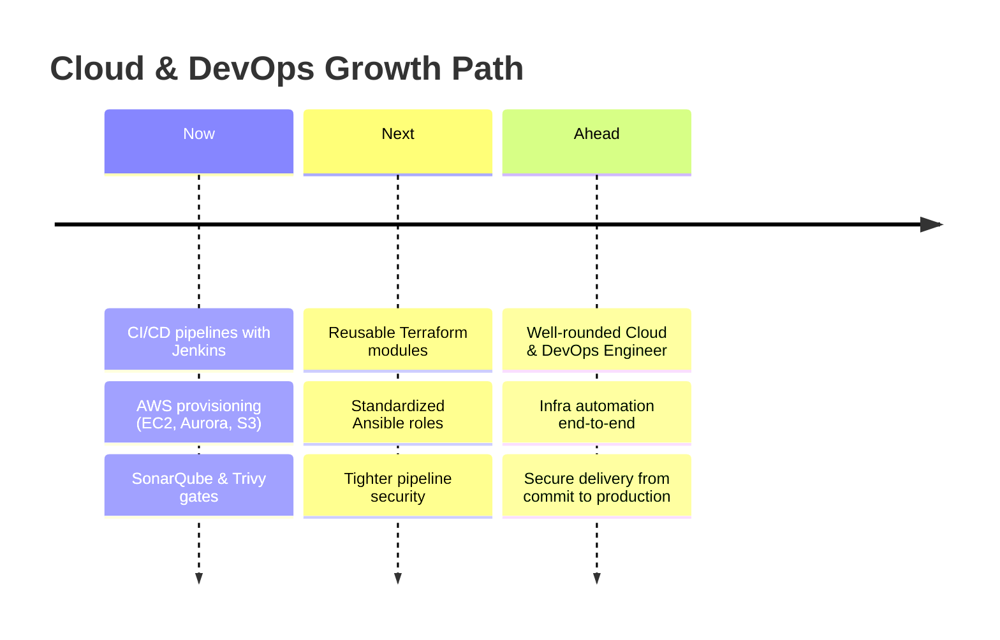

<div align="center">


<br>

<table>
<tr>
<td align="center" width="160"><sub>📍 LOCATION</sub><br><b>Patna, Bihar</b></td>
<td align="center" width="160"><sub>💼 ORGANIZATION</sub><br><b>MetConnect Infotech</b></td>
<td align="center" width="160"><sub>🎯 DOMAIN</sub><br><b>AWS · CI/CD · IaC</b></td>
<td align="center" width="160"><sub>👁 VISITORS</sub><br></td>
</tr>
</table>

<a href="https://www.linkedin.com/in/aditya-kaushik-11b39b276/"></a>&nbsp;
<a href="https://github.com/Adityachandkaushik"></a>

<br><br>

<a href="#-about"></a>
<a href="#-current-focus"></a>
<a href="#-in-progress"></a>
<a href="#-tech-stack"></a>
<a href="#-pipeline"></a>
<a href="#-projects"></a>
<a href="#-stats"></a>
<a href="#-connect"></a>

</div>

<br>

<a name="readme-top"></a>


<a name="-about"></a>

### `01` · About

<table width="100%">
<tr>
<td width="55%" valign="top">

```bash
$ whoami
> Aditya Kaushik — DevOps Engineer @ MetConnect Infotech
> Based in Patna, Bihar, India

$ cat mission.txt
> Turn a `git push` into a reliable, repeatable
> production release — build CI/CD pipelines,
> containerize with Docker, deploy on AWS.

$ status --daily-driver
> Jenkins · EC2 · Terraform · Ansible

$ echo $PHILOSOPHY
> "Pipelines that fail loudly, deployments that stay quiet."

$ _
```

</td>
<td width="45%" valign="top">

> **🔧 Building with**
> Docker · Jenkins · AWS EC2
> Aurora RDS · Nginx
> Terraform · Ansible

> **🔍 Integrating**
> SonarQube & Trivy woven into
> pipelines as quality and
> security gates

> **📝 Notes**
> I document what I learn on LinkedIn.

</td>
</tr>
</table>

<div align="right"><a href="#readme-top"><sub>↑ back to top</sub></a></div>

<a name="-current-focus"></a>

### `02` · Current Focus

<table width="100%">
<tr>
<td align="center" width="33%">
<h3>☁️</h3>
<b>Cloud Infrastructure</b>
<br><br>
<sub>Provisioning &amp; managing AWS — EC2, Aurora RDS, Route53, S3 — with an eye on reliability and cost.</sub>
</td>
<td align="center" width="33%">
<h3>🔁</h3>
<b>CI/CD Automation</b>
<br><br>
<sub>Jenkins pipelines that move code from commit → container → deployment with minimal manual steps.</sub>
</td>
<td align="center" width="33%">
<h3>🛡️</h3>
<b>Pipeline Security</b>
<br><br>
<sub>Wiring SonarQube &amp; Trivy into build stages so quality and vulnerability checks run before anything ships.</sub>
</td>
</tr>
</table>

<div align="right"><a href="#readme-top"><sub>↑ back to top</sub></a></div>

<a name="-in-progress"></a>

### `03` · In Progress

> [!TIP]
> **Currently leveling up:** writing more of my infrastructure as reusable **Terraform modules** and **Ansible roles**, and tightening the security gates in my **Jenkins pipelines**.

<table width="100%">
<tr>
<td width="33%"><b>Terraform</b><br><code>████████░░</code> 80%<br><sub>Reusable, modular IaC</sub></td>
<td width="33%"><b>Ansible</b><br><code>███████░░░</code> 70%<br><sub>Config management as code</sub></td>
<td width="33%"><b>Pipeline Security</b><br><code>███████░░░</code> 72%<br><sub>Sharper SonarQube &amp; Trivy gates</sub></td>
</tr>
</table>

<div align="right"><a href="#readme-top"><sub>↑ back to top</sub></a></div>


<a name="-tech-stack"></a>

### `04` · Tech Stack

<div align="center">


</div>

<table width="100%">
<tr>
<th width="50%" align="left">☁️ AWS Services</th>
<th width="50%" align="left">⚙️ Pipelines &amp; Containers</th>
</tr>
<tr>
<td valign="top">


<br>


</td>
<td valign="top">

<br>


</td>
</tr>
</table>

<div align="right"><a href="#readme-top"><sub>↑ back to top</sub></a></div>


<a name="-pipeline"></a>

### `05` · CI/CD Pipeline


```bash
$ pipeline run --project brilliant-pipeline

▸ [1/9] Checkout source ..................... ✔ done        (2s)
▸ [2/9] Install dependencies ................. ✔ done        (14s)
▸ [3/9] Run unit tests ....................... ✔ passed      (8s)
▸ [4/9] SonarQube quality gate ............... ✔ passed      (11s)
▸ [5/9] Trivy vulnerability scan .............. ✔ 0 critical  (6s)
▸ [6/9] Docker build .......................... ✔ image built (19s)
▸ [7/9] Docker push → registry ................ ✔ pushed      (5s)
▸ [8/9] Deploy to AWS EC2 ...................... ✔ live        (9s)
▸ [9/9] Health check ........................... ✔ 200 OK

✔ Pipeline succeeded — deployed to production in 1m14s
```

<p align="center"><sub>The pipeline shape I actually build: checkout → build/test → quality &amp; security gates → containerized deploy to EC2.</sub></p>

<div align="right"><a href="#readme-top"><sub>↑ back to top</sub></a></div>


<a name="-projects"></a>

### `06` · Featured Projects

<table width="100%">
<tr><td>

**📦 GoPass Backend**

Node.js + Express + MongoDB backend deployed on AWS EC2 with Aurora RDS, fronted by AWS WAF for baseline request filtering.

`Architecture` &nbsp;`Client → AWS WAF → EC2 (Express API) → Aurora RDS`
`Highlights` &nbsp;Production-hardened REST API · WAF-filtered edge · Managed relational data on Aurora

     

[**→ View Repository**](https://github.com/Adityachandkaushik?tab=repositories)

</td></tr>
</table>

<table width="100%">
<tr><td>

**🐳 Docker Production Setup**

Multi-container MERN stack orchestrated with Docker Compose — isolated frontend, backend, and database containers with custom networking and persistent volumes.

`Architecture` &nbsp;`frontend ⇄ backend ⇄ database` on a custom Docker network, backed by persistent volumes
`Highlights` &nbsp;Fully isolated service containers · Custom bridge networking · Persistent data volumes

   

[**→ View Repository**](https://github.com/Adityachandkaushik?tab=repositories)

</td></tr>
</table>

<table width="100%">
<tr><td>

**🔧 Jenkins Pipeline**

End-to-end CI pipeline: checkout from GitHub, build and test, scan with SonarQube and Trivy, then build and push a Docker image.

`Architecture` &nbsp;`GitHub → Jenkins → Build/Test → SonarQube → Trivy → Docker Build/Push`
`Highlights` &nbsp;Quality gate before merge · Vulnerability scan before publish · Fully scripted Jenkinsfile

   

[**→ View Repository**](https://github.com/Adityachandkaushik?tab=repositories)

</td></tr>
</table>

<table width="100%">
<tr><td>

**📚 Jenkins Shared Library**

Reusable Groovy pipeline functions that standardize common stages so they aren't rewritten across every project's Jenkinsfile.

`Architecture` &nbsp;`Shared Library (Groovy) ← imported by → N Jenkinsfiles`
`Highlights` &nbsp;DRY pipeline stages · Centralized maintenance · Consistent CI behavior across repos

  

[**→ View Repository**](https://github.com/Adityachandkaushik?tab=repositories)

</td></tr>
</table>

<table width="100%">
<tr><td>

**🔗 Docker + Jenkins Deployment**

The full loop — connecting the Jenkins pipeline above to an actual Docker deployment step, closing the gap between "build passes" and "it's live."

`Architecture` &nbsp;`Jenkins Pipeline → Docker Build → Docker Deploy → Running Service`
`Highlights` &nbsp;Closes CI → CD gap · Automated container rollout · Verified live deployment step

  

[**→ View Repository**](https://github.com/Adityachandkaushik?tab=repositories)

</td></tr>
</table>

<div align="center">

[**See all repositories →**](https://github.com/Adityachandkaushik?tab=repositories)

</div>

<div align="right"><a href="#readme-top"><sub>↑ back to top</sub></a></div>


<a name="-stats"></a>

### `07` · GitHub Stats

<table width="100%">
<tr>
<td width="50%"></td>
<td width="50%"></td>
</tr>
</table>

<div align="center">


<br><br>


<br><br>


</div>

<div align="right"><a href="#readme-top"><sub>↑ back to top</sub></a></div>


### `08` · Career Roadmap



> [!NOTE]
> Growing into a well-rounded **Cloud &amp; DevOps Engineer** — going deeper on infrastructure automation with Terraform and Ansible, and sharpening how I build and secure CI/CD pipelines from commit to production.

<div align="right"><a href="#readme-top"><sub>↑ back to top</sub></a></div>


<a name="-connect"></a>

### `09` · Let's Connect

<div align="center">

Open to DevOps, Cloud, and Platform Engineering conversations and opportunities.

<br>

<a href="https://www.linkedin.com/in/aditya-kaushik-11b39b276/"></a>
&nbsp;&nbsp;
<a href="https://github.com/Adityachandkaushik"></a>

</div>

<br>


<div align="center">
<sub>Aditya Kaushik · DevOps Engineer · Patna, Bihar, India</sub>
</div>
