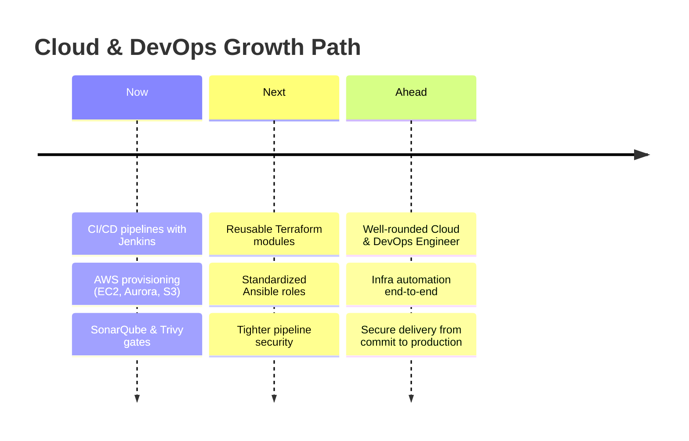

<div align="center">


<br>

<table>
<tr>
<td align="center"><code>📍 LOCATION</code><br><sub>Patna, Bihar, India</sub></td>
<td align="center"><code>💼 ORGANIZATION</code><br><sub>MetConnect Infotech</sub></td>
<td align="center"><code>🎯 DOMAIN</code><br><sub>AWS · CI/CD · IaC</sub></td>
<td align="center"><code>👁 VISITORS</code><br><sub></sub></td>
</tr>
</table>

<br>

<a href="https://www.linkedin.com/in/aditya-kaushik-11b39b276/"></a>&nbsp;
<a href="https://github.com/Adityachandkaushik"></a>

<br><br>

<table>
<tr>
<td><a href="#-about"></a></td>
<td><a href="#-current-focus"></a></td>
<td><a href="#-in-progress"></a></td>
<td><a href="#-tech-stack"></a></td>
<td><a href="#-pipeline"></a></td>
<td><a href="#-projects"></a></td>
<td><a href="#-stats"></a></td>
<td><a href="#-connect"></a></td>
</tr>
</table>

</div>


<a name="-about"></a>
## `01` About

<table width="100%">
<tr>
<td width="56%" valign="top">

<pre>
┌─ session ──────────────────────────────────────┐
│ user@devops-workstation                         │
└──────────────────────────────────────────────────┘
</pre>

```bash
$ whoami
> Aditya Kaushik — DevOps Engineer @ MetConnect Infotech
> Based in Patna, Bihar, India

$ cat mission.txt
> Turn a `git push` into a reliable, repeatable
> production release — build CI/CD pipelines,
> containerize with Docker, deploy on AWS.

$ status --daily-driver
> Jenkins · EC2 · Terraform · Ansible

$ echo $PHILOSOPHY
> "Pipelines that fail loudly, deployments that stay quiet."

$ _
```

</td>
<td width="44%" valign="top">

<table width="100%">
<tr><th align="left">🔧&nbsp; BUILDING WITH</th></tr>
<tr><td>
Docker&nbsp;·&nbsp;Jenkins<br>
AWS&nbsp;EC2&nbsp;·&nbsp;Aurora&nbsp;RDS<br>
Nginx&nbsp;·&nbsp;Terraform&nbsp;·&nbsp;Ansible
</td></tr>
</table>

<table width="100%">
<tr><th align="left">🔍&nbsp; INTEGRATING</th></tr>
<tr><td>
SonarQube &amp; Trivy woven into<br>
pipelines as quality and<br>
security gates
</td></tr>
</table>

<table width="100%">
<tr><th align="left">📝&nbsp; NOTES</th></tr>
<tr><td>
I document what I learn<br>
on LinkedIn.
</td></tr>
</table>

</td>
</tr>
</table>

<br>

<a name="-current-focus"></a>
## `02` Current Focus

<table width="100%">
<tr>
<td width="33%" valign="top">

<div align="center">

**☁️**
### Cloud Infrastructure

<sub>Provisioning &amp; managing AWS — EC2, Aurora RDS, Route53, S3 — with an eye on reliability and cost.</sub>

</div>

</td>
<td width="33%" valign="top">

<div align="center">

**🔁**
### CI/CD Automation

<sub>Jenkins pipelines that move code from commit → container → deployment with minimal manual steps.</sub>

</div>

</td>
<td width="33%" valign="top">

<div align="center">

**🛡️**
### Pipeline Security

<sub>Wiring SonarQube &amp; Trivy into build stages so quality and vulnerability checks run before anything ships.</sub>

</div>

</td>
</tr>
</table>

<br>

<a name="-in-progress"></a>
## `03` In Progress

> [!TIP]
> **Currently leveling up:** writing more of my infrastructure as reusable **Terraform modules** and **Ansible roles**, and tightening the security gates in my **Jenkins pipelines**.

<table width="100%">
<tr>
<td width="33%">

**Terraform**
`████████░░` 80%
<sub>Reusable, modular IaC</sub>

</td>
<td width="33%">

**Ansible**
`███████░░░` 70%
<sub>Config management as code</sub>

</td>
<td width="33%">

**Pipeline Security**
`███████░░░` 72%
<sub>Sharper SonarQube &amp; Trivy gates</sub>

</td>
</tr>
</table>

<br>


<a name="-tech-stack"></a>
## `04` Tech Stack

<div align="center">


</div>

<br>

<table width="100%">
<tr>
<th width="50%" align="left">☁️&nbsp; AWS SERVICES</th>
<th width="50%" align="left">⚙️&nbsp; PIPELINES &amp; CONTAINERS</th>
</tr>
<tr>
<td valign="top">


</td>
<td valign="top">


</td>
</tr>
</table>

<br>


<a name="-pipeline"></a>
## `05` CI/CD Pipeline

```mermaid
flowchart LR
    A[Push] --> B[GitHub]
    B --> C[Jenkins Trigger]
    C --> D[Build & Test]
    D --> E[SonarQube\nQuality Gate]
    E --> F[Trivy\nVulnerability Scan]
    F --> G[Docker Build]
    G --> H[Docker Push]
    H --> I[Deploy → AWS EC2]
    I --> J[Health Check]

    style A fill:#0A0E14,stroke:#00E5FF,color:#00E5FF
    style B fill:#0A0E14,stroke:#00E5FF,color:#00E5FF
    style C fill:#0A0E14,stroke:#00E5FF,color:#00E5FF
    style D fill:#0F1729,stroke:#8B95A7,color:#8B95A7
    style E fill:#0F1729,stroke:#FFB020,color:#FFB020
    style F fill:#0F1729,stroke:#FFB020,color:#FFB020
    style G fill:#0A0E14,stroke:#00E5FF,color:#00E5FF
    style H fill:#0A0E14,stroke:#00E5FF,color:#00E5FF
    style I fill:#0A0E14,stroke:#00E5FF,color:#00E5FF
    style J fill:#0F1729,stroke:#8B95A7,color:#8B95A7
```



```bash
$ pipeline run --project brilliant-pipeline

▸ [1/9] Checkout source ..................... ✔ done        (2s)
▸ [2/9] Install dependencies ................. ✔ done        (14s)
▸ [3/9] Run unit tests ....................... ✔ passed      (8s)
▸ [4/9] SonarQube quality gate ............... ✔ passed      (11s)
▸ [5/9] Trivy vulnerability scan .............. ✔ 0 critical  (6s)
▸ [6/9] Docker build .......................... ✔ image built (19s)
▸ [7/9] Docker push → registry ................ ✔ pushed      (5s)
▸ [8/9] Deploy to AWS EC2 ...................... ✔ live        (9s)
▸ [9/9] Health check ........................... ✔ 200 OK

✔ Pipeline succeeded — deployed to production in 1m14s
```

<p align="center"><sub>The pipeline shape I actually build: checkout → build/test → quality &amp; security gates → containerized deploy to EC2.</sub></p>

<br>


<a name="-projects"></a>
## `06` Featured Projects

<table width="100%">
<tr><td>

### 📦 &nbsp;GoPass Backend

**Description** — Node.js + Express + MongoDB backend deployed on AWS EC2 with Aurora RDS, fronted by AWS WAF for baseline request filtering.

**Architecture** — `Client → AWS WAF → EC2 (Express API) → Aurora RDS`

**Highlights** — Production-hardened REST API layer · WAF-filtered edge · Managed relational data on Aurora

**Technologies**
     

[**→ View Repository**](https://github.com/Adityachandkaushik?tab=repositories)

</td></tr>
</table>

<table width="100%">
<tr><td>

### 🐳 &nbsp;Docker Production Setup

**Description** — Multi-container MERN stack orchestrated with Docker Compose — isolated frontend, backend, and database containers with custom networking and persistent volumes.

**Architecture** — `frontend container ⇄ backend container ⇄ db container` on a custom Docker network, backed by persistent volumes

**Highlights** — Fully isolated service containers · Custom bridge networking · Persistent data volumes

**Technologies**
   

[**→ View Repository**](https://github.com/Adityachandkaushik?tab=repositories)

</td></tr>
</table>

<table width="100%">
<tr><td>

### 🔧 &nbsp;Jenkins Pipeline

**Description** — End-to-end CI pipeline: checkout from GitHub, build and test, scan with SonarQube and Trivy, then build and push a Docker image.

**Architecture** — `GitHub → Jenkins → Build/Test → SonarQube → Trivy → Docker Build/Push`

**Highlights** — Quality gate before merge · Vulnerability scan before publish · Fully scripted Jenkinsfile

**Technologies**
   

[**→ View Repository**](https://github.com/Adityachandkaushik?tab=repositories)

</td></tr>
</table>

<table width="100%">
<tr><td>

### 📚 &nbsp;Jenkins Shared Library

**Description** — Reusable Groovy pipeline functions that standardize common stages so they aren't rewritten across every project's Jenkinsfile.

**Architecture** — `Shared Library (Groovy) ← imported by → N Jenkinsfiles`

**Highlights** — DRY pipeline stages · Centralized maintenance · Consistent CI behavior across repos

**Technologies**
  

[**→ View Repository**](https://github.com/Adityachandkaushik?tab=repositories)

</td></tr>
</table>

<table width="100%">
<tr><td>

### 🔗 &nbsp;Docker + Jenkins Deployment

**Description** — The full loop — connecting the Jenkins pipeline above to an actual Docker deployment step, closing the gap between "build passes" and "it's live."

**Architecture** — `Jenkins Pipeline → Docker Build → Docker Deploy → Running Service`

**Highlights** — Closes CI → CD gap · Automated container rollout · Verified live deployment step

**Technologies**
  

[**→ View Repository**](https://github.com/Adityachandkaushik?tab=repositories)

</td></tr>
</table>

<div align="center">

[**See all repositories →**](https://github.com/Adityachandkaushik?tab=repositories)

</div>

<br>


<a name="-stats"></a>
## `07` GitHub Stats

<table width="100%">
<tr>
<td width="50%">

</td>
<td width="50%">

</td>
</tr>
</table>

<div align="center">


<br><br>


<br><br>


</div>

<br>


## `08` Career Roadmap



> [!NOTE]
> Growing into a well-rounded **Cloud &amp; DevOps Engineer** — going deeper on infrastructure automation with Terraform and Ansible, and sharpening how I build and secure CI/CD pipelines from commit to production.

<br>


<a name="-connect"></a>
## `09` Let's Connect

<div align="center">

### Open to DevOps, Cloud, and Platform Engineering conversations and opportunities.

<br>

<a href="https://www.linkedin.com/in/aditya-kaushik-11b39b276/"></a>
&nbsp;&nbsp;
<a href="https://github.com/Adityachandkaushik"></a>

</div>

<br>


<div align="center">
<sub>Aditya Kaushik · DevOps Engineer · Patna, Bihar, India</sub>
</div>
