 

  

 

### 👋 About Me

I'm a **DevOps Engineer** at **MetConnect Infotech Pvt Ltd**, based in Patna, Bihar, India.

I build CI/CD pipelines, containerize applications with Docker, and deploy them on AWS —
turning a `git push` into a reliable, repeatable production release. Day-to-day, that means
working with **Jenkins, EC2, Terraform, and Ansible** to keep infrastructure consistent and
deployments boring (in a good way).

I care about pipelines that fail loudly and deploy quietly — visibility into what's shipping,
and confidence that it'll stay up once it does.

<table width="100%">
<tr>
<td width="50%" valign="top">

**🔧 Currently building with**
Docker · Jenkins · AWS EC2 · Aurora RDS
Nginx · Terraform · Ansible

</td>
<td width="50%" valign="top">

**🔍 Also integrating**
SonarQube & Trivy into pipelines
for code quality and security scanning

</td>
</tr>
</table>

📝 I document what I learn on LinkedIn.

 

 

### 🎯 Current Focus

<table width="100%">
<tr>
<td width="33%" valign="top" align="center">

**☁️ Cloud Infrastructure**
Provisioning and managing AWS resources — EC2, Aurora RDS, Route53, S3 — with an eye on reliability and cost.

</td>
<td width="33%" valign="top" align="center">

**🔁 CI/CD Automation**
Building Jenkins pipelines that move code from commit to container to deployment with minimal manual steps.

</td>
<td width="33%" valign="top" align="center">

**🛡️ Pipeline Security**
Wiring SonarQube and Trivy into build stages so quality and vulnerability checks run before anything ships.

</td>
</tr>
</table>

 

### 📚 What I'm Learning

Currently focused on writing more of my infrastructure as reusable Terraform modules and Ansible roles, and tightening the security gates in my Jenkins pipelines.

 

 

### 🧰 Tech Stack

 

<strong>☁️ &nbsp; Cloud — AWS</strong>
  

  

<strong>⚙️ &nbsp; DevOps & Infrastructure</strong>
  

  

<strong>🐧 &nbsp; Core Tools</strong>
  

 

 

### 🗺️ DevOps Workflow

```mermaid
flowchart LR
    A[Developer Push] --> B[GitHub]
    B --> C[Jenkins Trigger]
    C --> D[Checkout & Build]
    D --> E[Test]
    E --> F[SonarQube\nCode Quality]
    F --> G[Trivy\nSecurity Scan]
    G --> H[Docker Build]
    H --> I[Docker Push]
    I --> J[Deploy to EC2]

    style A fill:#0B0F19,stroke:#00D9FF,color:#F3F4F6
    style B fill:#0B0F19,stroke:#00D9FF,color:#F3F4F6
    style C fill:#1F2937,stroke:#00D9FF,color:#F3F4F6
    style D fill:#1F2937,stroke:#00D9FF,color:#F3F4F6
    style E fill:#1F2937,stroke:#00D9FF,color:#F3F4F6
    style F fill:#14213D,stroke:#FF9900,color:#F3F4F6
    style G fill:#14213D,stroke:#FF9900,color:#F3F4F6
    style H fill:#0B0F19,stroke:#00D9FF,color:#F3F4F6
    style I fill:#0B0F19,stroke:#00D9FF,color:#F3F4F6
    style J fill:#0B0F19,stroke:#00D9FF,color:#F3F4F6
```

This is the shape of the pipelines I build — checkout, build, quality &amp; security scanning, then containerized deployment to EC2.

 

 

### 🚀 Featured Projects

<table width="100%">
<tr>
<td width="50%" valign="top">

**📦 GoPass Backend**

Node.js + Express + MongoDB backend deployed on AWS EC2 with Aurora RDS, fronted by AWS WAF for baseline request filtering.

`Node.js` `Express` `MongoDB` `EC2` `Aurora RDS` `WAF`

</td>
<td width="50%" valign="top">

**🐳 Docker Production Setup**

Multi-container MERN stack orchestrated with Docker Compose — isolated frontend, backend, and database containers with custom networking and persistent volumes.

`Docker Compose` `MERN` `Networking` `Volumes`

</td>
</tr>
<tr>
<td width="50%" valign="top">

**🔧 Jenkins Pipeline**

End-to-end CI pipeline: checkout from GitHub, build and test, scan with SonarQube and Trivy, then build and push a Docker image.

`Jenkins` `SonarQube` `Trivy` `Docker`

</td>
<td width="50%" valign="top">

**📚 Jenkins Shared Library**

Reusable Groovy pipeline functions that standardize common stages so they aren't rewritten across every project's Jenkinsfile.

`Groovy` `Jenkins` `CI/CD`

</td>
</tr>
<tr>
<td colspan="2" valign="top" align="center">

**🔗 Docker + Jenkins Deployment**

The full loop — connecting the Jenkins pipeline above to an actual Docker deployment step, closing the gap between "build passes" and "it's live."

`Jenkins` `Docker` `Deployment`

</td>
</tr>
</table>

[**See all repositories →**](https://github.com/Adityachandkaushik?tab=repositories)

 

 

### 📊 GitHub Stats

  

  

 

 

### 🎯 Career Objective

Growing into a well-rounded Cloud &amp; DevOps Engineer — going deeper on infrastructure automation with Terraform and Ansible, and sharpening how I build and secure CI/CD pipelines from commit to production.

 

 

### 🤝 Let's Connect

Open to DevOps, Cloud, and Platform Engineering conversations and opportunities.

Aditya Kaushik · DevOps Engineer · Patna, Bihar, India

