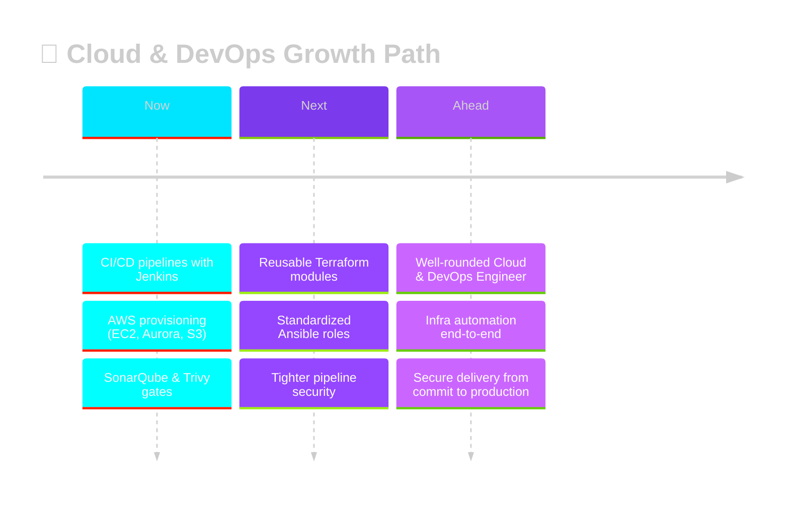

<div align="center">


<br>

`CI/CD` &nbsp;•&nbsp; `CLOUD` &nbsp;•&nbsp; `CONTAINERS` &nbsp;•&nbsp; `IaC`

<br>


<br><br>

<a href="https://www.linkedin.com/in/aditya-kaushik-11b39b276/"></a>
<a href="https://github.com/Adityachandkaushik"></a>

<br><br>

<a href="#-about"></a>
<a href="#-current-focus"></a>
<a href="#-in-progress"></a>
<a href="#-tech-stack"></a>
<a href="#-pipeline"></a>
<a href="#-projects"></a>
<a href="#-stats"></a>
<a href="#-connect"></a>

</div>

<a name="readme-top"></a>


<a name="-about"></a>

<div align="center">

<br>

<sub>01 / SECTION</sub>

# 🖥️ ABOUT ME

<sub>INFRASTRUCTURE &nbsp;•&nbsp; AUTOMATION &nbsp;•&nbsp; RELIABILITY</sub>

</div>

<br>

<table width="100%">
<tr>
<td width="55%" valign="top">

<table width="100%">
<tr><td>

```yaml
┌──────────────────────────────────────────────┐
│  root@devops-node ~ %  SYSTEM ONLINE          │
└──────────────────────────────────────────────┘
```

```bash
$ whoami
> Aditya Kaushik — DevOps Engineer @ MetConnect Infotech
> Based in Patna, Bihar, India

$ cat mission.txt
> Turn a `git push` into a reliable, repeatable
> production release — build CI/CD pipelines,
> containerize with Docker, deploy on AWS.

$ status --daily-driver
> Jenkins ⚙  EC2 ☁  Terraform 🧱  Ansible 🤖

$ echo $PHILOSOPHY
> "Pipelines that fail loudly, deployments that stay quiet."

$ ping motivation.io
> 64 bytes from uptime: time=∞ ms  🟢 ALIVE

$ _█
```

</td></tr>
</table>

</td>
<td width="45%" valign="top">

<table width="100%">
<tr><td>

**🔧&nbsp; BUILDING WITH**


</td></tr>
<tr><td>

**🔍&nbsp; INTEGRATING**

<sub>SonarQube ⚡ Trivy — wired straight into the pipeline as quality &amp; security gates.</sub>

</td></tr>
<tr><td>

**📝&nbsp; NOTES**

<sub>I document what I learn on **LinkedIn**.</sub>

</td></tr>
</table>

</td>
</tr>
</table>

<div align="right"><a href="#readme-top">⬆ back to top</a></div>


<a name="-current-focus"></a>

<div align="center">

<br>

<sub>02 / SECTION</sub>

# 🚀 CURRENT FOCUS

<sub>WHAT I'M ACTIVELY WORKING ON RIGHT NOW</sub>

</div>

<br>

<table width="100%">
<tr>
<td align="center" width="33%" valign="top">

<table width="100%"><tr><td align="center">

### ☁️
### CLOUD
<sub>INFRASTRUCTURE</sub>

<br>

Provisioning &amp; managing AWS — EC2, Aurora RDS, Route53, S3 — reliability &amp; cost, always in balance.

<br>


</td></tr></table>

</td>
<td align="center" width="33%" valign="top">

<table width="100%"><tr><td align="center">

### 🔁
### CI/CD
<sub>AUTOMATION</sub>

<br>

Jenkins pipelines moving code from commit → container → deployment, hands off the wheel.

<br>


</td></tr></table>

</td>
<td align="center" width="33%" valign="top">

<table width="100%"><tr><td align="center">

### 🛡️
### SECURITY
<sub>PIPELINE GATES</sub>

<br>

SonarQube &amp; Trivy wired into build stages — nothing ships without passing the gate.

<br>


</td></tr></table>

</td>
</tr>
</table>

<div align="right"><a href="#readme-top">⬆ back to top</a></div>

<a name="-in-progress"></a>

<div align="center">

<br>

<sub>03 / SECTION</sub>

# 🔥 LEVELING UP

<sub>ENGINEERING SKILLS — CURRENT PROGRESS</sub>

</div>

<br>

> [!TIP]
> **Currently leveling up:** writing more of my infrastructure as reusable **Terraform modules** and **Ansible roles**, and tightening the security gates in my **Jenkins pipelines**. ⚡

<br>

<table width="100%">
<tr>
<td width="33%" align="center">

**🧱 TERRAFORM**

`████████░░` **80%**

<sub>Reusable, modular IaC</sub>

</td>
<td width="33%" align="center">

**🤖 ANSIBLE**

`███████░░░` **70%**

<sub>Config management as code</sub>

</td>
<td width="33%" align="center">

**🛡️ PIPELINE SECURITY**

`███████░░░` **72%**

<sub>Sharper SonarQube &amp; Trivy gates</sub>

</td>
</tr>
</table>

<div align="right"><a href="#readme-top">⬆ back to top</a></div>


<a name="-tech-stack"></a>

<div align="center">

<br>

<sub>04 / SECTION</sub>

# 💠 TECH ARSENAL


</div>

<br>

<table width="100%">
<tr>
<td width="50%" valign="top">

<div align="center">

**☁️ AWS SERVICES**


</div>

</td>
<td width="50%" valign="top">

<div align="center">

**⚙️ PIPELINES &amp; CONTAINERS**


</div>

</td>
</tr>
</table>

<div align="right"><a href="#readme-top">⬆ back to top</a></div>


<a name="-pipeline"></a>

<div align="center">

<br>

<sub>05 / SECTION</sub>

# 🔁 CI/CD PIPELINE — LIVE

```mermaid
%%{init: {'theme':'dark', 'themeVariables': {'primaryColor':'#0B1020','primaryTextColor':'#F8FAFC','primaryBorderColor':'#00E5FF','lineColor':'#7C3AED','secondaryColor':'#05070D','tertiaryColor':'#05070D'}}}%%
flowchart LR
    A(["🔀 Push"]) --> B(["🐙 GitHub"])
    B --> C(["🔧 Jenkins Trigger"])
    C --> D(["🏗️ Build & Test"])
    D --> E(["🧪 SonarQube Gate"])
    E --> F(["🛡️ Trivy Scan"])
    F --> G(["🐳 Docker Build"])
    G --> H(["📤 Docker Push"])
    H --> I(["☁️ Deploy → EC2"])
    I --> J(["✅ Health Check"])
```

<sub>SOURCE → BUILD → QUALITY GATE → SECURITY → CONTAINER → REGISTRY → DEPLOY → HEALTH</sub>

</div>

<br>



```bash
$ pipeline run --project brilliant-pipeline --live

▸ [1/9] ⚡ Checkout source ....................... ✔ done        (2s)
▸ [2/9] 📦 Install dependencies .................. ✔ done        (14s)
▸ [3/9] 🧪 Run unit tests ........................ ✔ passed      (8s)
▸ [4/9] 🔍 SonarQube quality gate ................ ✔ passed      (11s)
▸ [5/9] 🛡️  Trivy vulnerability scan .............. ✔ 0 critical  (6s)
▸ [6/9] 🐳 Docker build .......................... ✔ image built (19s)
▸ [7/9] 📤 Docker push → registry ................ ✔ pushed      (5s)
▸ [8/9] ☁️  Deploy to AWS EC2 ..................... ✔ live        (9s)
▸ [9/9] ✅ Health check .......................... ✔ 200 OK

🎉 PIPELINE SUCCEEDED — deployed to production in 1m14s
```

<p align="center"><sub>⚡ The pipeline shape I actually build: checkout → build/test → quality &amp; security gates → containerized deploy to EC2.</sub></p>

<div align="right"><a href="#readme-top">⬆ back to top</a></div>


<a name="-projects"></a>

<div align="center">

<br>

<sub>06 / SECTION</sub>

# 🛰️ FEATURED PROJECTS

<sub>PRODUCTION &amp; PIPELINE WORK</sub>

</div>

<br>

<table width="100%">
<tr><td>

**📦&nbsp; GoPass Backend** &nbsp; 

Node.js + Express + MongoDB backend deployed on AWS EC2 with Aurora RDS, fronted by AWS WAF for baseline request filtering.

<sub>**ARCHITECTURE**</sub>
`Client → AWS WAF → EC2 (Express API) → Aurora RDS`

<sub>**HIGHLIGHTS**</sub>
Production-hardened REST API · WAF-filtered edge · Managed relational data on Aurora

     

[**⚡ View Repository →**](https://github.com/Adityachandkaushik?tab=repositories)

</td></tr>
</table>

<table width="100%">
<tr><td>

**🐳&nbsp; Docker Production Setup** &nbsp; 

Multi-container MERN stack orchestrated with Docker Compose — isolated frontend, backend, and database containers with custom networking and persistent volumes.

<sub>**ARCHITECTURE**</sub>
`frontend ⇄ backend ⇄ database` on a custom Docker network, backed by persistent volumes

<sub>**HIGHLIGHTS**</sub>
Fully isolated service containers · Custom bridge networking · Persistent data volumes

   

[**⚡ View Repository →**](https://github.com/Adityachandkaushik?tab=repositories)

</td></tr>
</table>

<table width="100%">
<tr><td>

**🔧&nbsp; Jenkins Pipeline** &nbsp; 

End-to-end CI pipeline: checkout from GitHub, build and test, scan with SonarQube and Trivy, then build and push a Docker image.

<sub>**ARCHITECTURE**</sub>
`GitHub → Jenkins → Build/Test → SonarQube → Trivy → Docker Build/Push`

<sub>**HIGHLIGHTS**</sub>
Quality gate before merge · Vulnerability scan before publish · Fully scripted Jenkinsfile

   

[**⚡ View Repository →**](https://github.com/Adityachandkaushik?tab=repositories)

</td></tr>
</table>

<table width="100%">
<tr><td>

**📚&nbsp; Jenkins Shared Library** &nbsp; 

Reusable Groovy pipeline functions that standardize common stages so they aren't rewritten across every project's Jenkinsfile.

<sub>**ARCHITECTURE**</sub>
`Shared Library (Groovy) ← imported by → N Jenkinsfiles`

<sub>**HIGHLIGHTS**</sub>
DRY pipeline stages · Centralized maintenance · Consistent CI behavior across repos

  

[**⚡ View Repository →**](https://github.com/Adityachandkaushik?tab=repositories)

</td></tr>
</table>

<table width="100%">
<tr><td>

**🔗&nbsp; Docker + Jenkins Deployment** &nbsp; 

The full loop — connecting the Jenkins pipeline above to an actual Docker deployment step, closing the gap between "build passes" and "it's live."

<sub>**ARCHITECTURE**</sub>
`Jenkins Pipeline → Docker Build → Docker Deploy → Running Service`

<sub>**HIGHLIGHTS**</sub>
Closes CI → CD gap · Automated container rollout · Verified live deployment step

  

[**⚡ View Repository →**](https://github.com/Adityachandkaushik?tab=repositories)

</td></tr>
</table>

<div align="center">

[**🌐 SEE ALL REPOSITORIES →**](https://github.com/Adityachandkaushik?tab=repositories)

</div>

<div align="right"><a href="#readme-top">⬆ back to top</a></div>


<a name="-stats"></a>

<div align="center">

<br>

<sub>07 / SECTION</sub>

# 📊 GITHUB STATS DASHBOARD

<sub>ACTIVITY, LANGUAGES &amp; CONTRIBUTIONS</sub>

<br>

<table width="100%">
<tr>
<td width="50%"></td>
<td width="50%"></td>
</tr>
</table>

<br>


<br><br>


<br><br>


</div>

<div align="right"><a href="#readme-top">⬆ back to top</a></div>


<a name="-roadmap"></a>

<div align="center">

<br>

<sub>08 / SECTION</sub>

# 🧭 CAREER ROADMAP

<sub>NOW → NEXT → AHEAD</sub>

</div>

<br>



> [!NOTE]
> Growing into a well-rounded **Cloud &amp; DevOps Engineer** — going deeper on infrastructure automation with Terraform and Ansible, and sharpening how I build and secure CI/CD pipelines from commit to production. ⚡

<div align="right"><a href="#readme-top">⬆ back to top</a></div>


<a name="-connect"></a>

<div align="center">

<br>

<sub>09 / SECTION</sub>

# 📡 LET'S CONNECT

<sub>READY TO CONNECT?</sub>

### 🔥 Open to DevOps, Cloud, and Platform Engineering conversations and opportunities.

<br>

<a href="https://www.linkedin.com/in/aditya-kaushik-11b39b276/"></a>
&nbsp;&nbsp;
<a href="https://github.com/Adityachandkaushik"></a>

</div>

<br>


<div align="center">
<sub>⚡ Aditya Kaushik · DevOps Engineer · Patna, Bihar, India ⚡</sub>
</div>
