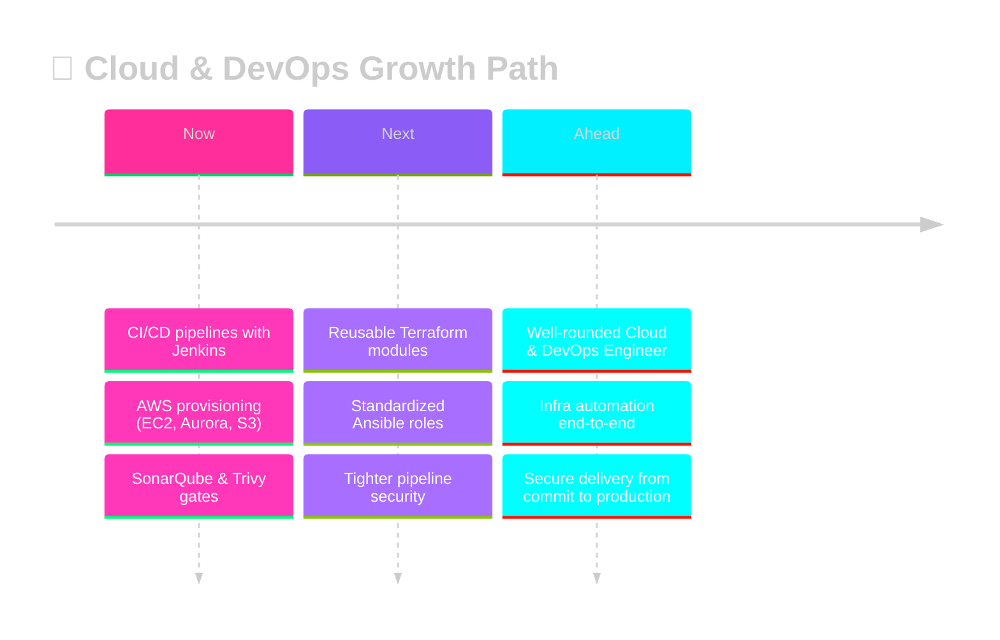

<div align="center">


<br>


<br><br>

<a href="https://www.linkedin.com/in/aditya-kaushik-11b39b276/"></a>
<a href="https://github.com/Adityachandkaushik"></a>

<br><br>

<a href="#-about"></a>
<a href="#-current-focus"></a>
<a href="#-in-progress"></a>
<a href="#-tech-stack"></a>
<a href="#-pipeline"></a>
<a href="#-projects"></a>
<a href="#-stats"></a>
<a href="#-connect"></a>

</div>

<a name="readme-top"></a>


<a name="-about"></a>

<div align="center">

# ⚡ `01` ABOUT ME

</div>

<table width="100%">
<tr>
<td width="55%" valign="top">

```yaml
┌──────────────────────────────────────────────┐
│  root@devops-node ~ %  SYSTEM ONLINE          │
└──────────────────────────────────────────────┘
```

```bash
$ whoami
> Aditya Kaushik — DevOps Engineer @ MetConnect Infotech
> Based in Patna, Bihar, India

$ cat mission.txt
> Turn a `git push` into a reliable, repeatable
> production release — build CI/CD pipelines,
> containerize with Docker, deploy on AWS.

$ status --daily-driver
> Jenkins ⚙  EC2 ☁  Terraform 🧱  Ansible 🤖

$ echo $PHILOSOPHY
> "Pipelines that fail loudly, deployments that stay quiet."

$ ping motivation.io
> 64 bytes from uptime: time=∞ ms  🟢 ALIVE

$ _█
```

</td>
<td width="45%" valign="top">

<table width="100%">
<tr><td>

### 🔧 &nbsp;BUILDING WITH


</td></tr>
<tr><td>

### 🔍 &nbsp;INTEGRATING
SonarQube ⚡ Trivy — wired straight into the pipeline as quality &amp; security gates.

</td></tr>
<tr><td>

### 📝 &nbsp;NOTES
I document what I learn on **LinkedIn**.

</td></tr>
</table>

</td>
</tr>
</table>

<div align="right"><a href="#readme-top">⬆ back to top</a></div>

<a name="-current-focus"></a>

<div align="center">

# 🚀 `02` CURRENT FOCUS

</div>

<table width="100%">
<tr>
<td align="center" width="33%">

╔═══════════════╗
### ☁️ CLOUD
╚═══════════════╝

**Infrastructure**

<sub>Provisioning &amp; managing AWS — EC2, Aurora RDS, Route53, S3 — reliability &amp; cost, always in balance.</sub>


</td>
<td align="center" width="33%">

╔═══════════════╗
### 🔁 CI/CD
╚═══════════════╝

**Automation**

<sub>Jenkins pipelines moving code from commit → container → deployment, hands off the wheel.</sub>


</td>
<td align="center" width="33%">

╔═══════════════╗
### 🛡️ SECURITY
╚═══════════════╝

**Pipeline Gates**

<sub>SonarQube &amp; Trivy wired into build stages — nothing ships without passing the gate.</sub>


</td>
</tr>
</table>

<div align="right"><a href="#readme-top">⬆ back to top</a></div>

<a name="-in-progress"></a>

<div align="center">

# 🔥 `03` LEVELING UP

</div>

> [!TIP]
> **Currently leveling up:** writing more of my infrastructure as reusable **Terraform modules** and **Ansible roles**, and tightening the security gates in my **Jenkins pipelines**. ⚡

<table width="100%">
<tr>
<td width="33%" align="center">

**🧱 TERRAFORM**
<br>
`🟪🟪🟪🟪🟪🟪🟪🟪⬛⬛` **80%**
<sub>Reusable, modular IaC</sub>

</td>
<td width="33%" align="center">

**🤖 ANSIBLE**
<br>
`🟦🟦🟦🟦🟦🟦🟦⬛⬛⬛` **70%**
<sub>Config management as code</sub>

</td>
<td width="33%" align="center">

**🛡️ PIPELINE SECURITY**
<br>
`🟥🟥🟥🟥🟥🟥🟥⬛⬛⬛` **72%**
<sub>Sharper SonarQube &amp; Trivy gates</sub>

</td>
</tr>
</table>

<div align="right"><a href="#readme-top">⬆ back to top</a></div>


<a name="-tech-stack"></a>

<div align="center">

# 💠 `04` TECH ARSENAL


</div>

<br>

<table width="100%">
<tr>
<td width="50%" valign="top">

<div align="center">

### ☁️ AWS SERVICES


</div>

</td>
<td width="50%" valign="top">

<div align="center">

### ⚙️ PIPELINES &amp; CONTAINERS


</div>

</td>
</tr>
</table>

<div align="right"><a href="#readme-top">⬆ back to top</a></div>


<a name="-pipeline"></a>

<div align="center">

# 🔁 `05` CI/CD PIPELINE — LIVE

</div>


```bash
$ pipeline run --project brilliant-pipeline --live

▸ [1/9] ⚡ Checkout source ....................... ✔ done        (2s)
▸ [2/9] 📦 Install dependencies .................. ✔ done        (14s)
▸ [3/9] 🧪 Run unit tests ........................ ✔ passed      (8s)
▸ [4/9] 🔍 SonarQube quality gate ................ ✔ passed      (11s)
▸ [5/9] 🛡️  Trivy vulnerability scan .............. ✔ 0 critical  (6s)
▸ [6/9] 🐳 Docker build .......................... ✔ image built (19s)
▸ [7/9] 📤 Docker push → registry ................ ✔ pushed      (5s)
▸ [8/9] ☁️  Deploy to AWS EC2 ..................... ✔ live        (9s)
▸ [9/9] ✅ Health check .......................... ✔ 200 OK

🎉 PIPELINE SUCCEEDED — deployed to production in 1m14s
```

<p align="center"><sub>⚡ The pipeline shape I actually build: checkout → build/test → quality &amp; security gates → containerized deploy to EC2.</sub></p>

<div align="right"><a href="#readme-top">⬆ back to top</a></div>


<a name="-projects"></a>

<div align="center">

# 🛰️ `06` FEATURED PROJECTS

</div>

<table width="100%">
<tr><td>

### 📦 &nbsp;GoPass Backend


Node.js + Express + MongoDB backend deployed on AWS EC2 with Aurora RDS, fronted by AWS WAF for baseline request filtering.

| | |
|---|---|
| 🏗️ **Architecture** | `Client → AWS WAF → EC2 (Express API) → Aurora RDS` |
| ⭐ **Highlights** | Production-hardened REST API · WAF-filtered edge · Managed relational data on Aurora |

     

[**⚡ View Repository →**](https://github.com/Adityachandkaushik?tab=repositories)

</td></tr>
</table>

<table width="100%">
<tr><td>

### 🐳 &nbsp;Docker Production Setup


Multi-container MERN stack orchestrated with Docker Compose — isolated frontend, backend, and database containers with custom networking and persistent volumes.

| | |
|---|---|
| 🏗️ **Architecture** | `frontend ⇄ backend ⇄ database` on a custom Docker network, backed by persistent volumes |
| ⭐ **Highlights** | Fully isolated service containers · Custom bridge networking · Persistent data volumes |

   

[**⚡ View Repository →**](https://github.com/Adityachandkaushik?tab=repositories)

</td></tr>
</table>

<table width="100%">
<tr><td>

### 🔧 &nbsp;Jenkins Pipeline


End-to-end CI pipeline: checkout from GitHub, build and test, scan with SonarQube and Trivy, then build and push a Docker image.

| | |
|---|---|
| 🏗️ **Architecture** | `GitHub → Jenkins → Build/Test → SonarQube → Trivy → Docker Build/Push` |
| ⭐ **Highlights** | Quality gate before merge · Vulnerability scan before publish · Fully scripted Jenkinsfile |

   

[**⚡ View Repository →**](https://github.com/Adityachandkaushik?tab=repositories)

</td></tr>
</table>

<table width="100%">
<tr><td>

### 📚 &nbsp;Jenkins Shared Library


Reusable Groovy pipeline functions that standardize common stages so they aren't rewritten across every project's Jenkinsfile.

| | |
|---|---|
| 🏗️ **Architecture** | `Shared Library (Groovy) ← imported by → N Jenkinsfiles` |
| ⭐ **Highlights** | DRY pipeline stages · Centralized maintenance · Consistent CI behavior across repos |

  

[**⚡ View Repository →**](https://github.com/Adityachandkaushik?tab=repositories)

</td></tr>
</table>

<table width="100%">
<tr><td>

### 🔗 &nbsp;Docker + Jenkins Deployment


The full loop — connecting the Jenkins pipeline above to an actual Docker deployment step, closing the gap between "build passes" and "it's live."

| | |
|---|---|
| 🏗️ **Architecture** | `Jenkins Pipeline → Docker Build → Docker Deploy → Running Service` |
| ⭐ **Highlights** | Closes CI → CD gap · Automated container rollout · Verified live deployment step |

  

[**⚡ View Repository →**](https://github.com/Adityachandkaushik?tab=repositories)

</td></tr>
</table>

<div align="center">

[**🌐 SEE ALL REPOSITORIES →**](https://github.com/Adityachandkaushik?tab=repositories)

</div>

<div align="right"><a href="#readme-top">⬆ back to top</a></div>


<a name="-stats"></a>

<div align="center">

# 📊 `07` GITHUB STATS DASHBOARD

<table width="100%">
<tr>
<td width="50%"></td>
<td width="50%"></td>
</tr>
</table>


<br><br>


<br><br>


</div>

<div align="right"><a href="#readme-top">⬆ back to top</a></div>


<div align="center">

# 🧭 `08` CAREER ROADMAP

</div>



> [!NOTE]
> Growing into a well-rounded **Cloud &amp; DevOps Engineer** — going deeper on infrastructure automation with Terraform and Ansible, and sharpening how I build and secure CI/CD pipelines from commit to production. ⚡

<div align="right"><a href="#readme-top">⬆ back to top</a></div>


<a name="-connect"></a>

<div align="center">

# 📡 `09` LET'S CONNECT

### 🔥 Open to DevOps, Cloud, and Platform Engineering conversations and opportunities.

<br>

<a href="https://www.linkedin.com/in/aditya-kaushik-11b39b276/"></a>
&nbsp;&nbsp;
<a href="https://github.com/Adityachandkaushik"></a>

</div>

<br>


<div align="center">
<sub>⚡ Aditya Kaushik · DevOps Engineer · Patna, Bihar, India ⚡</sub>
</div>
